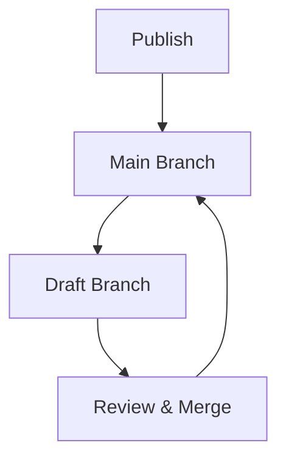

## Overview

Hugo Dias provides essential tools to streamline your documentation workflow. You organize content efficiently, collaborate with teams seamlessly, track changes with version control, and enable fast searches across your docs. These features help you maintain a professional knowledge base.

<Columns cols={2}>
  <Card title="Document Organization" icon="folder" href="#document-organization">
    Structure your docs with intuitive folders and hierarchies.
  </Card>
  <Card title="Team Collaboration" icon="users" href="#collaboration">
    Work together in real-time with comments and approvals.
  </Card>
  <Card title="Version Control" icon="git-branch" href="#version-control">
    Manage doc history like code with Git integration.
  </Card>
  <Card title="Search & Indexing" icon="search" href="#search">
    Find content instantly with powerful full-text search.
  </Card>
</Columns>

## Document Organization and Folder Structures

You create nested folder structures to mirror your project's architecture. Hugo Dias supports unlimited nesting, custom slugs, and automatic table of contents generation.

<Steps>
  <Step title="Create Folders" icon="folder-plus">
    Navigate to the dashboard and click "New Folder". Name it based on your project sections, like `api-reference` or `user-guides`.
  </Step>
  <Step title="Add Documents" icon="file-text">
    Drag and drop MDX files into folders or use the upload button.
  </Step>
  <Step title="Customize Hierarchy" icon="settings">
    Edit folder metadata for ordering and visibility.
  </Step>
</Steps>

Here is a sample folder structure:

```bash
docs/
├── introduction.mdx
├── api/
│   ├── endpoints.mdx
│   └── authentication.mdx
└── guides/
    ├── quickstart.mdx
    └── troubleshooting.mdx
```

<Callout kind="tip">
  Use descriptive folder names to improve navigation. Hugo Dias auto-generates sidebar menus from your structure.
</Callout>

## Collaboration Tools for Teams

Invite team members to co-edit docs with granular permissions. You review changes, add comments, and resolve conflicts effortlessly.

<Tabs>
  <Tab title="Comments" icon="message-circle">
    Highlight text and leave inline feedback.
    
    ```javascript
    // Example comment on this code
    const apiKey = process.env.API_KEY; // @reviewer: Add validation here?
    ```
  </Tab>
  <Tab title="Approvals" icon="check-circle">
    Set up workflows requiring peer review before publishing.
  </Tab>
  <Tab title="Real-time Edits" icon="edit-3">
    Multiple users edit simultaneously with live cursors.
  </Tab>
</Tabs>

## Version Control for Docs

Integrate Hugo Dias with Git repositories. You commit changes, create branches for drafts, and merge updates safely.

<CodeGroup tabs="GitHub, GitLab">
  ```bash
  # Connect your repo
  git remote add hugodias https://git.hugodias.example.com/project-docs.git
  git push origin main
  ```
  ```bash
  # Branch for new feature docs
  git checkout -b feature/new-api-docs
  git commit -m "Add API endpoints documentation"
  git push origin feature/new-api-docs
  ```
</CodeGroup>



## Search and Indexing Functionality

Hugo Dias indexes your entire documentation set for lightning-fast searches. You query by keywords, filter by sections, and get highlighted results.

<Expandable title="Advanced Search Options" default-open="false">
  Use operators like `AND`, `OR`, and exact phrases:
  
  | Operator | Example | Result |
  |----------|---------|--------|
  | `AND` | `API AND auth` | Pages with both terms |
  | `"exact phrase"` | `"user authentication"` | Exact matches |
  | `section:guides` | `troubleshooting section:guides` | Filter by folder |
  
  Results load in `<50ms` even for large docs.
</Expandable>

<Callout kind="info">
  Rebuild your index after major updates to ensure accuracy.
</Callout>

## Next Steps

Dive deeper with these resources:

<Columns cols={2}>
  <Card title="Quickstart Guide" icon="rocket" href="/quickstart">
    Set up your first project in minutes.
  </Card>
  <Card title="API Reference" icon="code" href="/api">
    Automate your workflows programmatically.
  </Card>
</Columns>