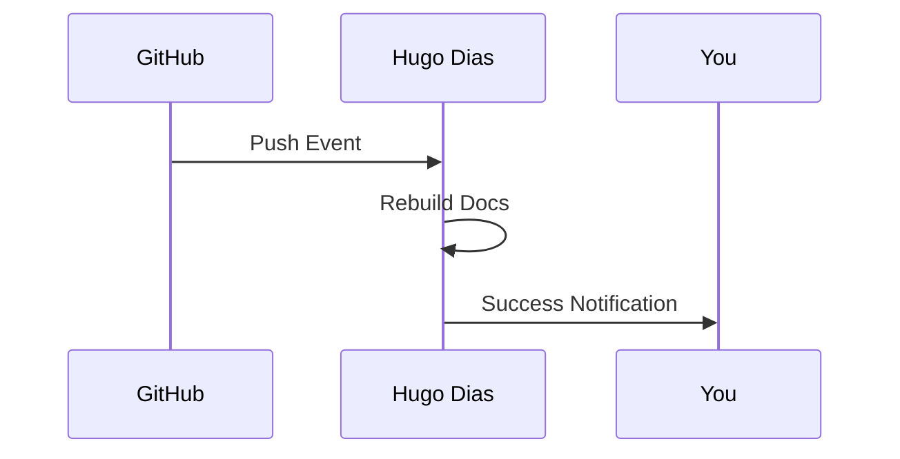

## Overview

Hugo Dias supports seamless integrations with popular tools to streamline your documentation process. Connect your repository for version control, export content in various formats, set up webhooks for automation, and use the API for custom extensions. These features help you maintain up-to-date docs without manual effort.

<Columns cols={3}>
  <Card title="GitHub Sync" icon="github" href="#github-integration">
    Automatically sync changes from your GitHub repo to live documentation.
  </Card>
  <Card title="Export Options" icon="download" href="#export-options">
    Generate PDFs or Markdown files for offline use or publishing.
  </Card>
  <Card title="Webhooks" icon="zap" href="#webhook-setup">
    Trigger builds and updates via incoming webhooks.
  </Card>
</Columns>

## GitHub Integration

Link your GitHub repository to Hugo Dias for automatic documentation updates on every push or pull request. This keeps your docs in sync with your codebase.

<Steps>
  <Step title="Connect Repository" icon="github">
    Navigate to Settings > Integrations in your Hugo Dias dashboard.
    
    Select GitHub and authorize the app.
  </Step>
  <Step title="Select Repo" icon="package">
    Choose your repository from the list.
    
    Configure branch (default: `main`) and sync frequency.
  </Step>
  <Step title="Enable Auto-Publish" icon="rocket">
    Toggle auto-publish on push events.
    
    Test the connection with a manual sync.
  </Step>
</Steps>

<Callout kind="tip">
  Use branch protection rules in GitHub to require docs approval before merging.
</Callout>

## Export Options

Export your documentation site to PDF for printing or Markdown for migration to other platforms.

<Tabs>
  <Tab title="PDF Export" icon="file-text">
    Generate a complete PDF of your docs.
    
    ```bash
    curl -X POST "https://api.example.com/v1/export/pdf" \
      -H "Authorization: Bearer YOUR_API_KEY" \
      -H "Content-Type: application/json" \
      -d '{
        "projectId": "proj_123abc",
        "includeToc": true
      }'
    ```
    
    Download the PDF from the returned URL.
  </Tab>
  <Tab title="Markdown Export" icon="file">
    Export all pages as a ZIP of Markdown files.
    
    ```bash
    curl -X POST "https://api.example.com/v1/export/markdown" \
      -H "Authorization: Bearer YOUR_API_KEY" \
      -d '{
        "projectId": "proj_123abc",
        "format": "github-flavored"
      }'
    ```
  </Tab>
</Tabs>

## Webhook Setup

Set up webhooks to automate documentation updates from external events like CI/CD pipelines.

<Steps>
  <Step title="Create Webhook" icon="zap">
    Go to Settings > Webhooks and click "New Webhook".
    
    Copy the webhook URL: `https://webhooks.example.com/hugo-dias/YOUR_WEBHOOK_ID`.
  </Step>
  <Step title="Configure Events" icon="settings">
    Select events like `push` or `pull_request`.
    
    Add secret: `YOUR_WEBHOOK_SECRET`.
  </Step>
  <Step title="Test Delivery" icon="play">
    Send a test payload from your GitHub repo settings.
  </Step>
</Steps>



## API Access for Custom Extensions

Build custom integrations using the Hugo Dias REST API. Authenticate with your API key.

<ParamField header="Authorization" param-type="string" required="true">
  Bearer token: `Bearer YOUR_API_KEY`.
</ParamField>

<ParamField query="projectId" param-type="string" required="true">
  Your project identifier, e.g., `proj_123abc`.
</ParamField>

<CodeGroup tabs="JavaScript,Python">
  ```javascript
  const response = await fetch('https://api.example.com/v1/docs/publish', {
    method: 'POST',
    headers: {
      'Authorization': 'Bearer YOUR_API_KEY',
      'Content-Type': 'application/json'
    },
    body: JSON.stringify({
      projectId: 'proj_123abc',
      branch: 'main'
    })
  });
  ```
  ```python
  import requests
  
  response = requests.post(
    'https://api.example.com/v1/docs/publish',
    headers={
      'Authorization': 'Bearer YOUR_API_KEY',
      'Content-Type': 'application/json'
    },
    json={
      'projectId': 'proj_123abc',
      'branch': 'main'
    }
  )
  ```
</CodeGroup>

<Response tabs="200">
```json
{
  "success": true,
  "publishUrl": "https://docs.example.com/project/proj_123abc",
  "status": "published"
}
```
</Response>

<Expandable title="Advanced API Usage" default-open="false">
  Rate limits: 100 requests per minute. Use `{X-RateLimit-Remaining}` header to monitor.
</Expandable>

<Callout kind="alert">
  Store API keys securely and rotate them regularly. Never commit them to version control.
</Callout>